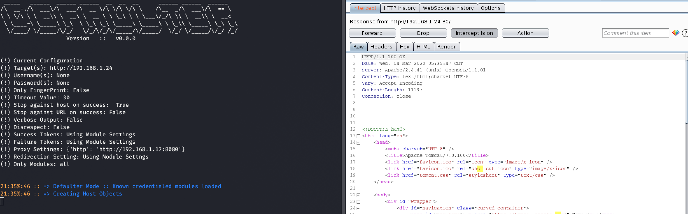

# Overview

Defaulter attempts to scan applications for DEFAULTED KNOWN CREDENTIALS. The design is meant to be modular,
meaning input files are read based on how an application performs its authentication. This allows the tool
to be able to know how to craft each REQUEST to determine if the credentials are valid or not. 

**NOTE: This is still an early build, and its based on the most complex authentication schemes I have seen wrapped
around the most simple. So errors that may not have been handled correct are likely to occur. Also
module configuration files are subject to change as well.**

# USAGE

```
Usage: ./defaulter [-i|--input] target [options]

Options:
  -h, --help            show this help message and exit

  Required:
    -i INPUT, --input=INPUT
                        URL target or File containing URLs

  Informational options:
    -v, --verbose       Outputs more information
    --validation        Validates module configuration [ ALL by default] also
                        works with targeted modules

  Output Options:
    --output-txt=OUTPUT_TXT
                        Outputs results to TXT

  Scanning related options:
    --only-fingerprint  Scanning will only fingerprint targets
    -u USERS, --users=USERS
                        List of usernames or comma separated
    -p PASSWORDS, --passwords=PASSWORDS
                        List of passwords or comma separated
    --disrespect        Disregard modules threshold value
    --only-modules=MODULES
                        Activates particular modules, default will load
                        anything in modules directory
    -t TIMEOUT, --timeout=TIMEOUT
                        Set timeout :: default [3]
    --stop-host         Stop scanning host on first successful user hit
    --stop-url          Stop scanning URL on first successful hit
    --proxy=PROXY       Proxy settings in form 'http:localhost:8080'

  Custom Scanning [ --only-modules or --custom] options:
    --success=SUCCESS   Define custom success tokens with --only-module
    --failure=FAILURE   Define custom failure tokens with --only-module
    --redirection=REDIRECTION
                        Instructs authentication to follow redirects
                        [True/False] otherwise follows modules settings
    --token-uri=TOKEN   Custom URI to retrieve hidden inputs used for
                        authentication
    --post-url=POST_URL
                        Custom post url for application
    --get-url=GET_URL   Custom get url for application
    --mod-config=MOD_CONFIG
                        Force authentication to utilize particular config
                        regardless of fingerprint. Inputting 'wordpress:0' will
                        use the first configuration in wordpress
                        can be comma separated
    --auth=AUTH_TYPE    Authentication Type used [ Basic / Form / Api ]
    --cookies           Determines if a session needs to be established first
    --custom            Allows custom authentication specification
    --user-param=USER_PARAM
                        Username parameter for login to application
    --pass-param=PASS_PARAM
                        Password parameter for login to application

```

# Examples

Below are different examples and details about the various features of the tool.

## Basic Output

Running the tool in Defaulter Mode, when targeted/custom scanning isn't specified. Only
modules that have known DEFAULT usernames and passwords will be loaded based on the 
loaded configuration files in modules directory.


## Proxy Setting Example

Proxy functionality has also been added. This can be helpful when troubleshooting
a custom module and etc. 



## Finger Print Only Mode

Based on the modules installed, the program will attempt to only perform fingerprinting 
if it detects particular keywords based on the applications make and model


## Module Validation 

The script itself will attempt to validate module configuration files before attempting to use. 
You can specify validation only mode to verify if module files you create are in the valid form.


## Targeted Scanning

By default the tool will utilize each module file, but you  can be more direct and only
instruct the script to scan particular applications. Utilizing targeted scan mode allows
you to further customize a custom as well to change success tokens and etc.


## Force Module Configuration Authentication

This setting allows users to force the authentication attempt to conform to a particular 
module configuration, regardless of the fingerprint. If the fingerprint seems wrong or
you want to determine if a particular configuration will work on a particular model, 
then this can help with that.

In the example below, we see that the application has been fingerprinted as WordPress 5, but we want to 
utilize the second configuration instead (Just an example in changing the URL).


## Custom Scan Mode

Custom scan allows you to fully tune customize a scan attempt if a module file doesn't
exist. As we can see in the example, this shows a HacktheBox (HTB) machine that uses
a BASIC authentication scheme. We are able to configure the neccessary options and 
receive a valid login. 


